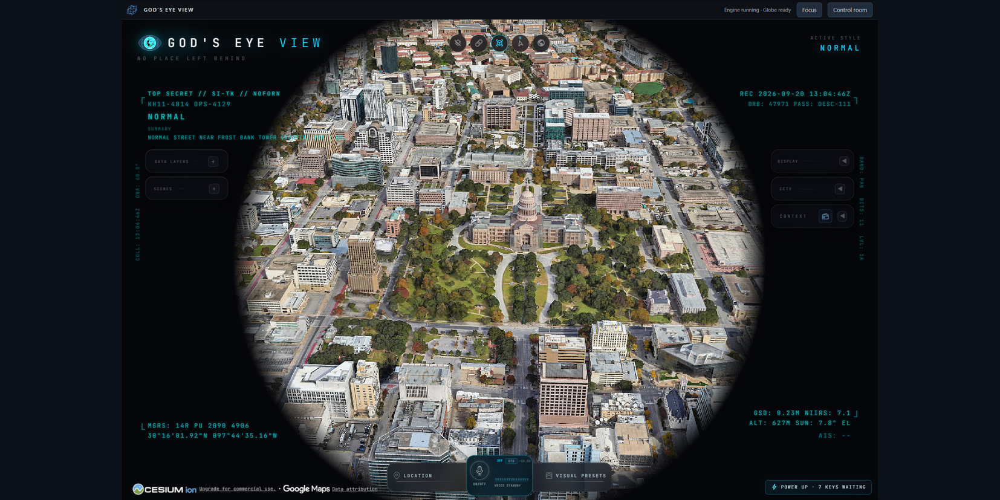

# God's Eye View for Hermes Desktop

A community integration that puts [Bilawal Sidhu's God's Eye View](https://github.com/bilawalsidhu/gods-eye-view) inside Hermes Desktop. The native globe remains the main interface; a compact flight deck and optional Control room handle the local engine.

**Unofficial integration.** Not maintained or endorsed by the GEV author, Cesium, Google, or Nous Research. Submitting this package to the Hermes catalog does not itself mean catalog approval.



*Actual Windows Desktop capture, cropped to the plugin and letterboxed; imagery attribution retained. Photorealistic imagery availability depends on upstream/provider configuration. Decorative classification and recording labels belong to GEV's visual styling, not actual classification or recording status.*

## What it provides

- One native GEV webview, preserving upstream scenes, layers, styles, and provider controls.
- A slim flight deck with engine/render readiness and Focus/restore.
- A tucked-away Control room for Start, Stop, Reload globe, and Provider Settings.
- Explicit update checks and dirty-checkout-protected updates for your **separate GEV application checkout**.
- An opt-in compatibility key bridge; native Provider Settings is the preferred setup path.
- A `hermes gev configure` command for choosing an existing checkout and Node runtime.

No model-facing tools, autonomous monitoring, tracking, automatic startup, or bundled provider credentials. Process health is not proof that a feed is fresh or that credentials authenticate.

## Requirements

- Hermes **Desktop** with the plugin SDK and companion dashboard API support, Hermes >=0.21.3.
- **Windows or macOS.** An embedded GPU-capable Electron view is required; the CLI or web dashboard alone is not a substitute.
- An existing installation of official GEV, with its dependencies installed outside this plugin directory.
- A Node version allowed by that checkout. The tested upstream package requires `>=24.14.0 <25 || >=26 <27`; Node 24 is recommended.
- Git and npm if you use the upstream application's update controls.

GEV providers are optional and carry their own terms, quotas, and billing. Hermes OAuth subscriptions are not provider API keys.

## Install

Before catalog approval, install directly from this repository:

```sh
hermes plugins install https://github.com/cygnostik/Hermes-Plugin-Gods-Eye-View --enable
```

For a reproducible installation, add `--ref FULL_40_CHARACTER_COMMIT` using the exact commit displayed on the release. The placeholder is not a branch or tag. Once a catalog entry has been merged, `hermes plugins install gods-eye-view --enable` will resolve its reviewed pin.

The package contains both `desktop/plugin.js` and `dashboard/plugin_api.py`. After first installing/enabling it, restart Desktop at a safe point so its backend mounts the companion API. Do not restart an active agent turn. Renderer hot reload alone does not mount new Python routes.

### Connect your GEV installation

If you do not have GEV yet, follow the [official installation instructions](https://github.com/bilawalsidhu/gods-eye-view#readme) using a compatible Node version. Keep its checkout outside Hermes' replaceable plugin directory. This package does not download runtimes or install GEV automatically.

Then point the plugin at that checkout and Node executable, for example on Windows:

```sh
hermes gev configure --root "C:/Apps/gods-eye-view" --node "C:/Program Files/nodejs/node.exe"
```

On macOS, with a supported Node runtime already on `PATH`:

```sh
hermes gev configure --root "$HOME/Projects/gods-eye-view" --node "$(command -v node)"
```

The configurator recognizes Windows and standard macOS/Homebrew npm layouts. If npm is installed separately, pass `--npm-cli` with its `npm-cli.js` path. GEV starts only on request; no login item or background service is installed.

Use `hermes gev configure --help` for the npm CLI and port options. Paths above are examples, not directories created by the plugin. Nonsecret settings and runtime logs live in the active profile's `plugin-data/gods-eye-view/`, outside the installed package. Configuration does not start the server.

Open **God's Eye View** from the sidebar, then **Start engine**. Use **Control room → Provider Settings** for optional keys. The native application owns its key store; keys are not part of this repository or the plugin's settings file.

## Known limitations

- **Key-save reload recovery is unresolved.** Saving a provider key restarts the upstream Vite server. One observed save left the embedded interface incomplete/apparently unstyled. Switching to a chat session and back to GEV recovered it. A restart/asset-loading race is suspected, not proven; the loading-label fix does not establish that this is fixed.
- Trusted external `_blank` anchor links are handed to the default browser. Arbitrary `window.open` buttons are not proven through that path. Use the standalone application when a native external button does not open.
- Voice/microphone permissions, every provider's authentication, and live feed freshness are not certified by this wrapper's tests.
- A remote Hermes backend is not supported: the guest's localhost endpoint must refer to the same machine as Desktop.
- Local GEV source changes stop an update before any server disruption. Resolve or back up them yourself; the plugin never discards them.

See [verification and scope](docs/verification.md) and [security/data boundaries](SECURITY.md).

## Updates and removal

The plugin never downloads replacements for its own files. Catalog plugin updates use reviewed commit pins and Hermes' plugin installer. Direct pinned installs require explicitly choosing a new reviewed commit.

The Control room's update action applies only to the separately configured official GEV checkout. It performs Git fast-forward and locked npm dependency installation after a clean-checkout check. It can stop/restart that app and may need network access. It never updates Hermes or this plugin.

Plugin replacement leaves its durable settings/logs and the external GEV checkout/key store intact. Disabling/uninstalling does not delete that application or its keys. Stop the engine explicitly first if it should no longer run.

## Development

```sh
npm ci
npm test
python -m unittest discover -s tests/backend -p "test_*.py" -v
hermes plugins validate .
hermes plugins doctor . --ci
```

Frontend tests use real React/React DOM/React Query/JSDOM with mocked guest and transport APIs. They do not substitute for Electron GPU testing. Python test dependencies are declared in `requirements-dev.txt`.

## Attribution

The wrapper code is MIT-licensed. GEV remains a separate MIT-licensed project by Bilawal Sidhu; its source, datasets, provider terms, and imagery rights are not transferred by this package's license. Native imagery attribution is retained. Hermes Agent is by Nous Research. Maintainer: [cygnostik](https://github.com/cygnostik), ProDyn.ai.
