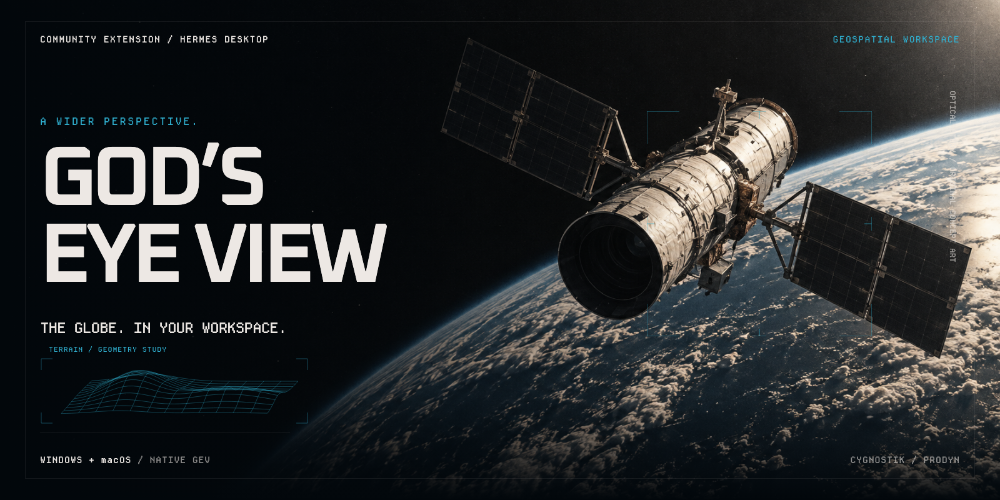

*Original satellite concept art, not a product screenshot.*

# God’s Eye View for Hermes Desktop

**A wider perspective. One sidebar away.**

Explore [Bilawal Sidhu’s God’s Eye View](https://github.com/bilawalsidhu/gods-eye-view) without leaving Hermes Desktop. The native globe, scenes, layers and provider controls stay intact. A compact flight deck puts the local engine within reach.

[Install](#install) · [Official GEV](https://github.com/bilawalsidhu/gods-eye-view) · [Verification](docs/verification.md) · [Report an issue](https://github.com/cygnostik/Hermes-Plugin-Gods-Eye-View/issues)


*Actual Windows capture, cropped to the plugin; imagery attribution retained. Photorealistic imagery depends on your GEV providers. Classification and recording labels are part of GEV’s visual styling, not actual classification or recording status.*

## Your view. Your controls.

| In the workspace | What you can do |
| --- | --- |
| **Native globe** | Explore GEV’s places, scenes, layers and visual styles in its own interface. |
| **Flight deck** | See engine and globe-loading status. Enter Focus mode to give the view more room. |
| **Control room** | Start or stop the engine, recreate the view with Reload globe, and open Provider Settings. |
| **Engine maintenance** | Check for upstream GEV updates, then explicitly apply them. Local source changes block the update before the engine is stopped. |

GEV remains a separate installation. The plugin connects it to Hermes Desktop; it doesn’t replace or fork the engine.

### Voice belongs to GEV

GEV already has its own voice controls for actions such as navigation and orbiting, using an OpenAI API key and microphone permission. They remain part of the upstream application; voice and microphone permissions in the embedded view have not been verified. This release is a user-operated workspace, not a Hermes agent-control bridge.

## Install

You’ll need **Hermes Desktop 0.21.3 or newer**, **Windows or macOS**, **Git**, and a separate [official GEV Git checkout](https://github.com/bilawalsidhu/gods-eye-view#readme) with its npm dependencies installed. Use **Node 24.x (24.14.0 or later), or 26.x**, subject to that checkout’s engine requirements.

### 1. Add the plugin

Install directly from this repository:

```sh
hermes plugins install https://github.com/cygnostik/Hermes-Plugin-Gods-Eye-View --enable
```

Catalog approval is pending. The direct-repository command works independently of catalog approval.

### 2. Connect your GEV checkout

**macOS** — with a supported Node version on your PATH:

```sh
hermes gev configure --root "$HOME/Projects/gods-eye-view" --node "$(command -v node)"
```

**Windows** — replace the example paths with your installations:

```sh
hermes gev configure --root "C:/Apps/gods-eye-view" --node "C:/Program Files/nodejs/node.exe"
```

Keep GEV outside Hermes’ replaceable plugin directory. If npm is installed separately, supply its `npm-cli.js` path with `--npm-cli`. Run `hermes gev configure --help` for all options.

### 3. Enable the Desktop view

Restart Hermes Desktop after your active runs finish. Open **Capabilities → Plugins → God’s Eye View** and turn on **Desktop**. The Desktop switch is separate from the agent-side enable switch.

Select **God’s Eye View** in the sidebar, then **Start engine**. You’re connected when the flight deck says **Engine running · Globe ready** and the globe is visible.

Start with GEV’s keyless imagery and terrain. For optional providers, including photorealistic 3D, open **Control room → Provider Settings**. They have their own terms, quotas and billing. Nothing starts automatically at login. Windows provider-save rendering recovery still awaits a live recheck; **Reload globe** recreates the embedded view.

## Everyday operation

- **Focus** hides the flight deck. **Show flight deck** restores it.
- **Reload globe** creates a fresh embedded view. Use it if GEV looks incomplete after a restart or provider change; it can reset the current view.
- **Update engine** updates your separate GEV checkout, not Hermes or this plugin. Updates are explicit, never part of status polling.
- Stop the engine before disabling or uninstalling the plugin if you want GEV to stop running too. Removing the plugin does not remove GEV, its keys, or the plugin’s saved configuration.

## Providers, data and support

Provider keys normally stay in GEV’s native configuration. An optional compatibility bridge can copy supported Hermes environment keys when you explicitly allow it; Hermes OAuth subscriptions are not interchangeable with provider API keys.

The engine runs on the same machine as Hermes Desktop. Imagery and feeds may use external services. This wrapper does not certify their freshness or provider authentication. See [security and data boundaries](SECURITY.md).

**Current verification:** Windows and macOS [automated checks pass](https://github.com/cygnostik/Hermes-Plugin-Gods-Eye-View/actions/runs/35784735033); the Mac workspace and improved reload have been checked live. See [verification and known limitations](docs/verification.md) for the remaining Windows provider-save check, microphone, external-link and platform scope.

## Development

```sh
npm ci
npm test
python -m pip install -r requirements-dev.txt
python -m unittest discover -s tests/backend -p "test_*.py" -v
hermes plugins validate .
hermes plugins doctor . --ci
```

[Changelog](CHANGELOG.md) · [Roadmap](docs/ROADMAP.md) · [Issues](https://github.com/cygnostik/Hermes-Plugin-Gods-Eye-View/issues)

## Built on good work

**God’s Eye View:** [Bilawal Sidhu](https://github.com/bilawalsidhu/gods-eye-view). **Hermes Agent:** [Nous Research](https://github.com/NousResearch/hermes-agent). **Community integration:** [cygnostik](https://github.com/cygnostik) / [ProDyn](https://prodyn.ai).

This is an independent community integration, not an official GEV or Nous Research release. The wrapper is [MIT-licensed](LICENSE); upstream software, datasets and imagery retain their own licenses and terms.
