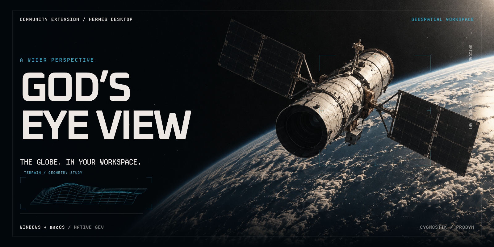
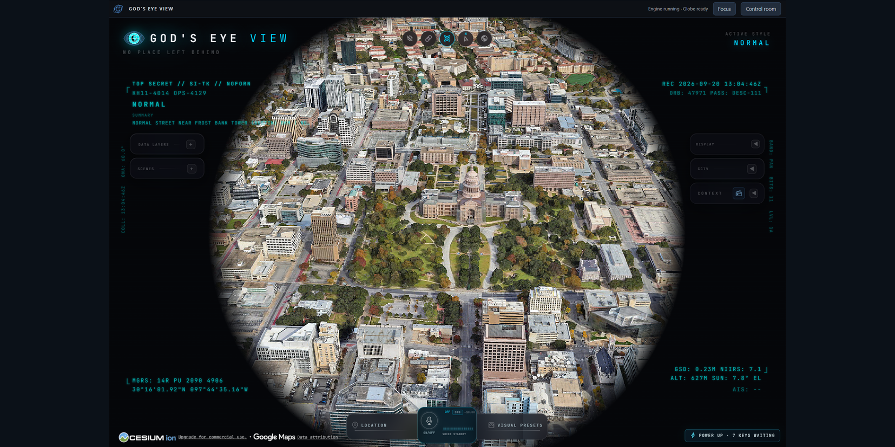

# LEGACY COMPATIBILITY — v0.1.3-legacy.1

Not SDK/catalog approved. This branch is a separately published historical renderer, not the main SDK line. The Install section below deliberately installs the supported SDK baseline, not this prerelease. For a pinned compatibility install attempt and its limitations, use the prerelease notes; do not replace an active SDK installation merely to test legacy.



*Original satellite concept art, not a product screenshot.*

# God’s Eye View for Hermes Desktop

**A wider perspective. One sidebar away.**

A community wrapper for [Bilawal Sidhu’s God’s Eye View](https://github.com/bilawalsidhu/gods-eye-view), with explicit local engine controls. Embedded availability depends on the release line and upstream framing policy; read the status below before installing.

[Install](#install) · [Official GEV](https://github.com/bilawalsidhu/gods-eye-view) · [Verification](docs/verification.md) · [Report an issue](https://github.com/cygnostik/Hermes-Plugin-Gods-Eye-View/issues)



*v0.1.0 Windows capture (before the SDK frame migration), cropped to the plugin; imagery attribution retained. Photorealistic imagery depends on your GEV providers. Classification and recording labels are part of GEV’s visual styling, not actual classification or recording status.*

## Integration status — October 2, 2026 (Pacific time)

The catalog SDK line remains **v0.1.2**, pinned to `8eec0b3ede21b4971e840cb1cf35457087a1a6cb`. Catalog admission is not live rendering acceptance. Current Windows acceptance recovered the backend and controls, but the local GEV engine rejects the SDK frame with `Content-Security-Policy: frame-ancestors 'none'` and `X-Frame-Options: DENY`. The native console confirms the framing refusal. This is a regression after the SDK-required migration, not evidence that the original Electron guest never worked.

**Immediate supported fallback:** Start engine, then **Open in browser**. Browser globe rendering and camera interaction were observed in the October 2 acceptance run; they do not fulfill embedded rendering. After Desktop quits, an explicit Start may be needed. Provider-save recovery in the SDK frame remains untested because framing is rejected first.

### LEGACY COMPATIBILITY — separate, not SDK/catalog approved

- [v0.1.0 historical release](https://github.com/cygnostik/Hermes-Plugin-Gods-Eye-View/releases/tag/v0.1.0), source `c871d9b1e17a962acb3bd7d2a8d851fe313f8daf`, was already public. Historical embedded live verification dates are September 20 and September 25, 2026; the [September 25 exact-pin Windows results](https://github.com/cygnostik/Hermes-Plugin-Gods-Eye-View/issues/1) include visible camera interaction and scoped provider-save recovery. These are not fresh tests of today's Hermes/upstream combination.
- [v0.1.3-legacy.1 compatibility prerelease](https://github.com/cygnostik/Hermes-Plugin-Gods-Eye-View/releases/tag/v0.1.3-legacy.1) restores only that renderer and its matching frontend tests onto the v0.1.2 backend/dependency baseline. Unlike immutable v0.1.0, it retains `psutil>=5.9,<8; sys_platform != 'android'`, avoiding the known universal Android resolution conflict. It does not add Android support.
- The legacy renderer uses raw Electron webview, Hermes' shared `persist:hermes-preview` partition, private preload IPC and guest scripting. This coupling is outside the supported SDK and is **not catalog approved**. Host changes may break it. Current validation/installation can reject it; **stop on refusal**, do not bypass scanners, copy it into discovery, weaken sandbox/headers or treat historical validation as current approval.
- The compatibility release is a separate branch/prerelease, never a catalog re-pin or replacement for main. See its release notes for the exact immutable source/install reference, actual regression results and admission result. No current native rendering acceptance or maintainer exception is claimed.

## Your view. Your controls.

| In the workspace | What you can do |
| --- | --- |
| **Native globe** | Historical legacy embedding; currently blocked in the SDK line. Use Open in browser. |
| **Flight deck** | See backend engine status. Enter Focus mode to give the view more room. |
| **Control room** | Start or stop the engine, recreate the view with Reload globe, and find GEV’s own Provider Settings chip. |
| **Engine maintenance** | Check for upstream GEV updates, then explicitly apply them. Local source changes block the update before the engine is stopped. |

GEV remains a separate installation. The plugin connects it to Hermes Desktop; it doesn’t replace or fork the engine.

### Voice belongs to GEV

GEV already has its own voice controls for actions such as navigation and orbiting, using an OpenAI API key and microphone permission. They remain part of the upstream application; voice and microphone permissions in the embedded view have not been verified. This release is a user-operated workspace, not a Hermes agent-control bridge.

## Install

You’ll need **Hermes Desktop 0.21.5 or newer**, **Windows or macOS**, **Git**, and a separate [official GEV Git checkout](https://github.com/bilawalsidhu/gods-eye-view#readme) with its npm dependencies installed. Use **Node 24.x (24.14.0 or later), or 26.x**, subject to that checkout’s engine requirements.

### 1. Add the plugin

Install directly from this repository:

```sh
hermes plugins install https://github.com/cygnostik/Hermes-Plugin-Gods-Eye-View --ref 8eec0b3ede21b4971e840cb1cf35457087a1a6cb --enable
```

This installs the accepted SDK release, not legacy compatibility. Catalog PR #122028 merged October 2, 2026 at 23:46 UTC. The embedded globe limitation above still applies; approval does not certify live rendering.

### 2. Connect your GEV checkout

**macOS** — with a supported Node version on your PATH:

```sh
hermes gev configure --root "$HOME/Projects/gods-eye-view" --node "$(command -v node)"
```

**Windows** — replace the example paths with your installations:

```sh
hermes gev configure --root "C:/Apps/gods-eye-view" --node "C:/Program Files/nodejs/node.exe"
```

Keep GEV outside Hermes’ replaceable plugin directory. If npm is installed separately, supply its `npm-cli.js` path with `--npm-cli`. Run `hermes gev configure --help` for all options.

### 3. Enable the Desktop view

Restart Hermes Desktop after your active runs finish. Open **Capabilities → Plugins → God’s Eye View** and turn on **Desktop**. The Desktop switch is separate from the agent-side enable switch.

Select **God’s Eye View** in the sidebar, then **Start engine**. The flight deck reports **Engine running** from the backend; check the visible globe separately. Engine status does not verify rendering or provider access.

Start with GEV’s keyless imagery and terrain. For optional providers, including photorealistic 3D, select **Control room → Provider Settings** for directions to GEV’s own settings chip inside the globe. They have their own terms, quotas and billing. Nothing starts automatically at login. Windows foreground acceptance passed on v0.1.0 ([results](https://github.com/cygnostik/Hermes-Plugin-Gods-Eye-View/issues/1)); the v0.1.1/v0.1.2 SDK frame is blocked by the observed upstream anti-framing headers; **Reload globe** recreates the embedded view.

## Everyday operation

- **Focus** hides the flight deck. **Show flight deck** restores it.
- **Reload globe** creates a fresh embedded view. Use it if GEV looks incomplete after a restart or provider change; it can reset the current view.
- **Update engine** updates your separate GEV checkout, not Hermes or this plugin. Updates are explicit, never part of status polling.
- Stop the engine before disabling or uninstalling the plugin if you want GEV to stop running too. Removing the plugin does not remove GEV, its keys, or the plugin’s saved configuration.

## Providers, data and support

Provider keys normally stay in GEV’s native configuration. An optional compatibility bridge can copy supported Hermes environment keys when you explicitly allow it; Hermes OAuth subscriptions are not interchangeable with provider API keys.

The engine runs on the same machine as Hermes Desktop. Imagery and feeds may use external services. This wrapper does not certify their freshness or provider authentication. See [security and data boundaries](SECURITY.md).

**Verification:** v0.1.0 had Windows/macOS automated checks and live Desktop acceptance. v0.1.1 replaces the embedding with the SDK’s opaque-origin frame; see [verification and known limitations](docs/verification.md) for scoped checks and the current framing blocker.

## Development

This branch intentionally fails the published SDK-only policy even if a local validator misses the raw-webview usage. Passing tests/doctor are not catalog admission. See [actual compatibility checks](docs/verification.md).

```sh
npm ci
npm test
python -m pip install -r requirements-dev.txt
python -m unittest discover -s tests/backend -p "test_*.py" -v
hermes plugins validate .
hermes plugins doctor . --ci
```

[Changelog](CHANGELOG.md) · [Roadmap](docs/ROADMAP.md) · [Issues](https://github.com/cygnostik/Hermes-Plugin-Gods-Eye-View/issues)

## Built on good work

**God’s Eye View:** [Bilawal Sidhu](https://github.com/bilawalsidhu/gods-eye-view). **Hermes Agent:** [Nous Research](https://github.com/NousResearch/hermes-agent). **Community integration:** [cygnostik](https://github.com/cygnostik) / [ProDyn](https://prodyn.ai).

This is an independent community integration, not an official GEV or Nous Research release. The wrapper is [MIT-licensed](LICENSE); upstream software, datasets and imagery retain their own licenses and terms.
